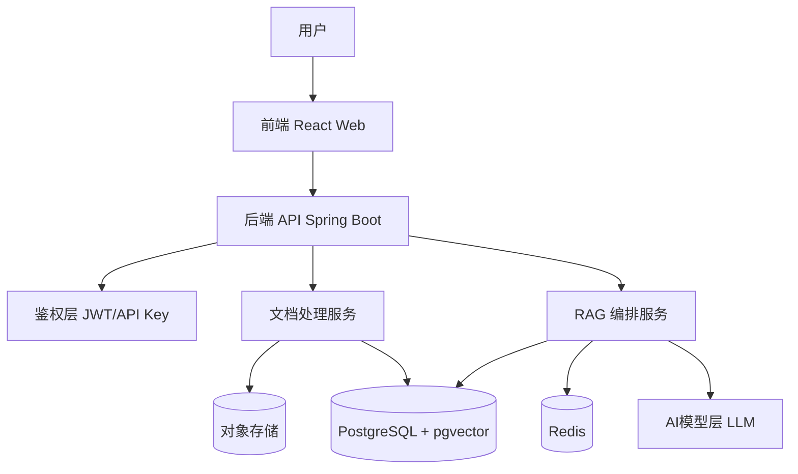
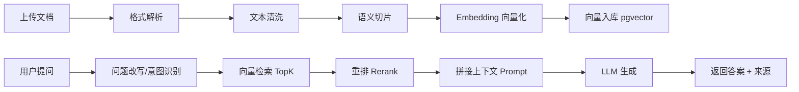
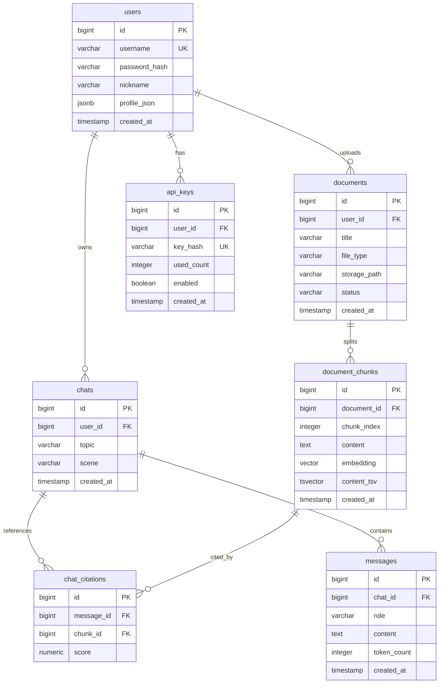
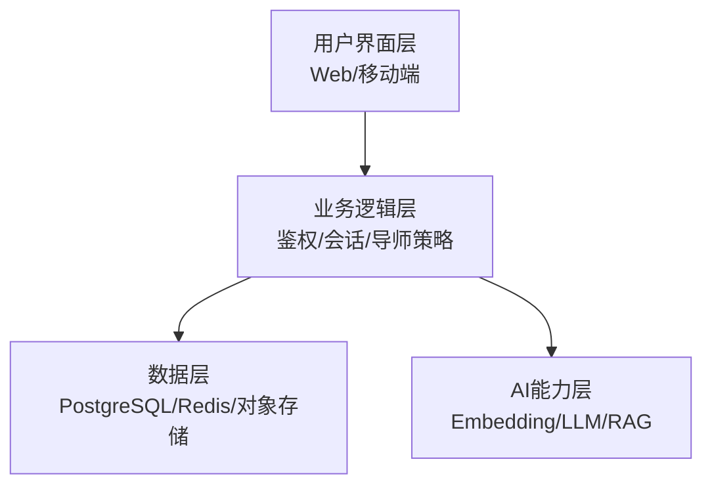
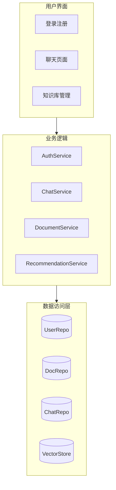
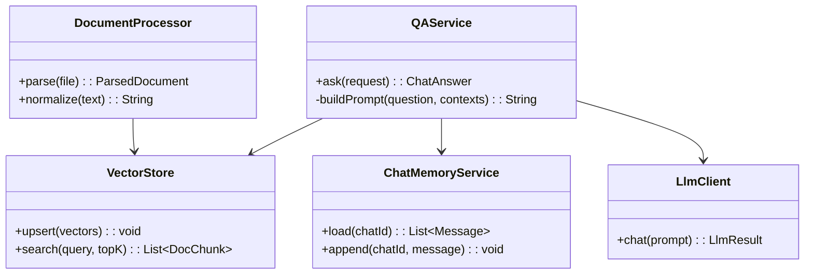
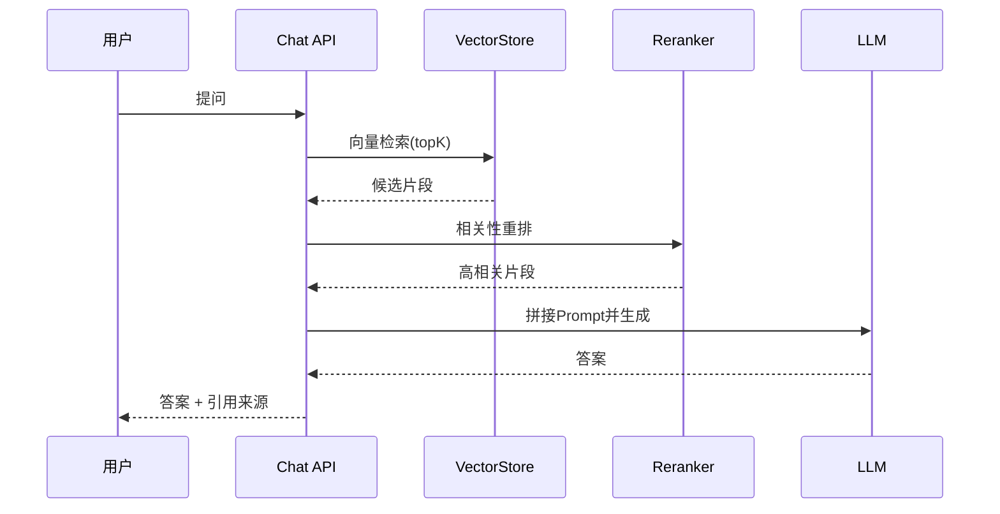
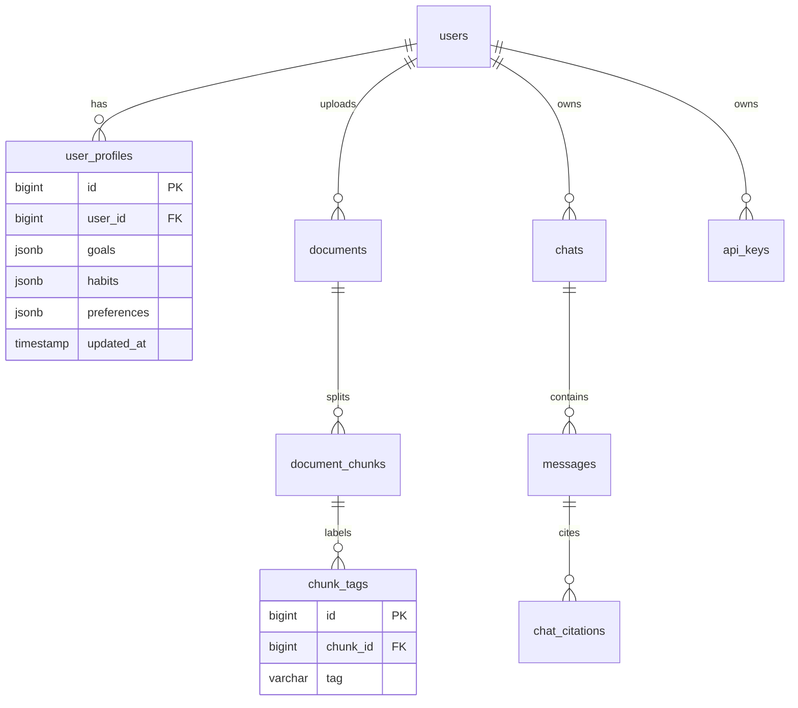

# 个性化AI生活导师

[](https://github.com/your-org/ai-life-mentor/releases)
[](https://github.com/your-org/ai-life-mentor/actions)
[](./LICENSE)
[](https://www.oracle.com/java/)
[](https://react.dev/)

一个面向个人成长场景的智能问答系统，帮助用户在学习、职业、情绪、关系与健康等议题上获得可执行建议。  
系统基于 **RAG（Retrieval-Augmented Generation）** 架构，支持多源知识导入、向量检索与上下文增强回答。  
通过对话记忆与用户画像，模型能给出更贴合个人目标和阶段的建议。  
支持 Web 前端、REST API、流式响应、知识库管理与会话追踪。  

---

## 项目基本信息

- **项目名称**：个性化AI生活导师
- **核心功能（3句话）**：
  1. 基于大模型与 **RAG** 的生活导师问答系统，覆盖目标管理、情绪调节、职业规划等场景。  
  2. 支持 Markdown/PDF/Word 文档解析与切片入库，自动构建可检索的个人知识库。  
  3. 输出带上下文来源的建议，并结合用户画像与历史对话提供连续、个性化指导。  
- **技术栈**：`Java 17`、`Spring Boot`、`React`、`PostgreSQL`、`Redis`、`pgvector`、`LangChain4j`、`Docker`
- **项目背景**：用户面对生活决策时，往往信息分散、执行路径不清。本项目通过结构化知识与智能问答，降低检索成本并提升行动落地效率。

---

## 功能列表

- 用户注册登录（JWT + API Key 双鉴权）
- 文档上传与解析（PDF/Word/Markdown）
- 文档切片、向量化与向量库存储
- 多轮对话与上下文记忆
- 检索增强生成（RAG）回答
- 回答来源追踪与引用展示
- 历史会话管理与关键结论沉淀
- 管理台配置模型参数、提示词模板和知识库分组

---

## 技术架构图



说明：前端负责交互，后端统一编排业务；文档处理模块将知识转为向量，RAG 服务负责检索、重排与生成，最终由大模型输出答案。

---

## 详细技术实现

### 1) 数据流说明（从上传到回答）



说明：上传链路构建知识索引，问答链路通过检索到的证据增强提示词，减少幻觉并提升可解释性。

### 2) 关键模块描述

- **文档解析模块（DocumentProcessor）**：处理 PDF/Word/Markdown，统一输出标准文本块与元数据。
- **向量化模块（EmbeddingService）**：将文本切片转为向量并写入 `pgvector`，同时维护文档版本。
- **检索增强模块（QAService）**：执行 Query 改写、TopK 召回、重排、Prompt 组装与答案生成。
- **会话记忆模块（ChatMemoryService）**：维护短期上下文与长期用户偏好，保证建议连续性。

### 3) 核心代码片段

```java
public ChatAnswer ask(ChatRequest request) {
    UserProfile profile = userService.loadProfile(request.userId());
    String rewrittenQuery = queryRewriteService.rewrite(request.question(), profile);
    List<DocChunk> candidates = vectorStore.search(rewrittenQuery, 8);
    List<DocChunk> topChunks = rerankService.rerank(rewrittenQuery, candidates, 4);

    String prompt = promptBuilder.buildMentorPrompt(
        request.question(),
        profile,
        topChunks
    );
    LlmResult llmResult = llmClient.chat(prompt);
    return answerAssembler.toChatAnswer(llmResult, topChunks);
}
```

```java
public void ingestDocument(DocumentPayload payload) {
    ParsedDocument parsed = documentProcessor.parse(payload);
    List<TextChunk> chunks = chunkService.split(parsed.content(), 500, 100);
    List<VectorRecord> vectors = embeddingService.embed(chunks, parsed.metadata());
    vectorStore.upsert(vectors);
    documentRepository.markIndexed(payload.documentId(), vectors.size());
}
```

---

## 数据库设计

### 1) ER 图



说明：`users` 为核心实体，`documents` 与 `chats` 分别承载知识来源与交互记录，`chat_citations` 负责回答可追溯性。

### 2) 表结构说明（字段、类型、索引）

| 表名 | 关键字段 | 类型 | 说明 | 索引建议 |
|---|---|---|---|---|
| users | username | varchar | 登录账号 | 唯一索引 `uk_users_username` |
| users | profile_json | jsonb | 个性画像、偏好标签 | GIN 索引 |
| documents | user_id, status | bigint, varchar | 用户文档与处理状态 | 组合索引 `idx_docs_user_status` |
| document_chunks | embedding | vector | 向量检索字段 | ivfflat/hnsw 向量索引 |
| document_chunks | content_tsv | tsvector | 关键词召回 | GIN 索引 |
| chats | user_id, created_at | bigint, timestamp | 会话列表与排序 | 组合索引 |
| messages | chat_id, created_at | bigint, timestamp | 会话消息序列 | 组合索引 |
| api_keys | key_hash | varchar | API 鉴权 | 唯一索引 |

---

## 安装与部署

### 1) 环境要求

- `JDK 17+`
- `Node.js 18+`
- `PostgreSQL 14+`（安装 `pgvector` 扩展）
- `Redis 6+`
- `Docker` / `Docker Compose`（可选）

### 2) 克隆项目

```bash
git clone https://github.com/your-org/ai-life-mentor.git
cd ai-life-mentor
```

### 3) 启动依赖服务（推荐 Docker）

```bash
docker compose up -d postgres redis
```

### 4) 配置环境变量

```bash
cp .env.example .env
```

`.env` 关键项：

```env
APP_JWT_SECRET=replace_with_32_chars_secret
DB_URL=jdbc:postgresql://localhost:5432/ai_life_mentor
DB_USERNAME=postgres
DB_PASSWORD=postgres
REDIS_HOST=localhost
REDIS_PORT=6379
LLM_API_KEY=your_llm_api_key
EMBEDDING_MODEL=text-embedding-v3
CHAT_MODEL=qwen-max
```

### 5) 启动后端

```bash
./mvnw spring-boot:run
```

### 6) 启动前端

```bash
cd ai-agent-frontend
npm install
npm run dev
```

### 7) 访问地址

- 前端：`http://localhost:5173`
- 后端：`http://localhost:8123`
- Swagger：`http://localhost:8123/swagger-ui/index.html`

---

## 接口示例

### 1) 文档上传接口

**请求**

```http
POST /api/documents/upload
Authorization: Bearer <token>
Content-Type: multipart/form-data
```

```bash
curl -X POST "http://localhost:8123/api/documents/upload" \
  -H "Authorization: Bearer <token>" \
  -F "file=@./knowledge/goal-planning.pdf" \
  -F "category=career"
```

**响应**

```json
{
  "code": 0,
  "message": "success",
  "data": {
    "documentId": 1024,
    "status": "PROCESSING",
    "estimatedChunks": 68
  }
}
```

### 2) 智能问答接口

**请求**

```bash
curl -X POST "http://localhost:8123/api/ai/mentor/chat" \
  -H "Content-Type: application/json" \
  -H "Authorization: Bearer <token>" \
  -d '{
    "chatId": 2001,
    "question": "我总是拖延，怎么拆解今天的学习计划？",
    "scene": "study"
  }'
```

**响应**

```json
{
  "code": 0,
  "message": "success",
  "data": {
    "answer": "你可以先用15分钟完成最小任务单元...",
    "citations": [
      {
        "documentId": 1024,
        "chunkId": 30991,
        "score": 0.87,
        "snippet": "将任务拆成可在25分钟内完成的最小动作..."
      }
    ],
    "requestId": "chat_20260430_9f8a"
  }
}
```

---

## 系统设计（仿 Word 文档结构）

### 1) 总体架构图



说明：采用分层架构解耦 UI、业务与 AI 能力，便于独立扩展与灰度发布。

### 2) 模块划分图



说明：展示层只负责交互，服务层承载核心业务，数据层统一持久化与检索能力。

### 3) 类图（关键类关系）



说明：`QAService` 是问答主入口，协调检索、记忆与模型调用；`DocumentProcessor` 负责知识入库前处理。

---

## 核心实现

### 1) 关键技术选型原因

- 选择 **PostgreSQL + pgvector**：统一结构化数据与向量数据，降低运维复杂度，适合中小规模迭代。
- 选择 **Redis**：用于会话缓存、限流和热点上下文，降低响应时延。
- 选择 **LangChain4j**：在 Java 生态中提供较完整的 LLM/RAG 编排能力，便于与 Spring Boot 集成。
- 暂不优先 **Milvus**：在当前数据量级下，`pgvector` 已满足召回性能，且部署成本更低。

### 2) RAG 工作流程图



说明：先召回再重排的两阶段检索可兼顾速度与精度，最后附带引用提升可信度。

---

## 更详细数据库说明

### ER 图（详细版）



说明：在基础 ER 之上，增加 `user_profiles` 与 `chunk_tags`，支持个性化画像和语义标签增强检索。

### 表结构清单（表名、字段、说明）

- `users`：`id`、`username`、`password_hash`、`nickname`、`created_at`；存储账户主数据。  
- `user_profiles`：`user_id`、`goals`、`habits`、`preferences`；存储用户长期偏好与阶段目标。  
- `documents`：`user_id`、`title`、`file_type`、`status`、`storage_path`；文档主记录。  
- `document_chunks`：`document_id`、`chunk_index`、`content`、`embedding`；知识切片与向量。  
- `chats`：`user_id`、`topic`、`scene`、`created_at`；会话维度。  
- `messages`：`chat_id`、`role`、`content`、`token_count`；消息明细。  
- `chat_citations`：`message_id`、`chunk_id`、`score`；回答引用来源。  
- `api_keys`：`user_id`、`key_hash`、`enabled`、`used_count`；第三方调用鉴权。  

---

## 未来规划

- 引入多智能体协作（规划、执行、复盘）以支持复杂目标管理。
- 增强长期记忆与行为追踪，实现“周计划-日执行-复盘”闭环。
- 支持多模态输入（图片/语音）与跨端同步（Web/移动端）。

---

## 总结与展望

本项目构建了一个可落地的个性化 AI 导师系统原型，完成了从知识入库、检索增强到可追溯回答的闭环。  
当前不足主要在于超长上下文压缩、多轮对话一致性和复杂任务自动执行能力仍有提升空间。  
下一阶段将围绕多模态、长期记忆与策略执行引擎升级，进一步提升建议质量与行动转化率。  
