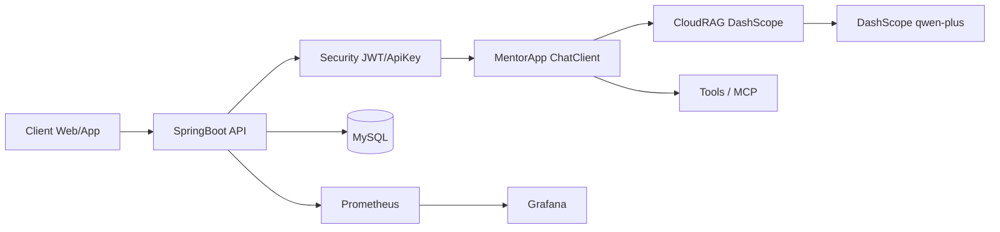

# 知域Agent - Backend

[](https://openjdk.org/)
[](https://spring.io/projects/spring-boot)
[](https://spring.io/projects/spring-ai)
[](https://vuejs.org/)
[](https://www.xucanwei.top)

知域Agent 是一个面向个人成长的 AI 助手系统，通过大模型、RAG 知识检索与工具调用，帮助用户在学习、职业、情绪、健康与关系等场景中获得可执行的行动建议。

<h3 align="center"><a href="https://www.xucanwei.top">🌐 www.xucanwei.top</a></h3>

---

## 技术栈

| 层面 | 技术 |
|------|------|
| 语言 | Java 21 |
| 框架 | Spring Boot 3.5.6, Spring AI 1.0.0-M6 (Alibaba DashScope) |
| LLM | 通义千问 (qwen-plus) via DashScope SDK 2.19.1 |
| RAG | 百炼云知识库 + 可选本地向量存储 (SimpleVectorStore / pgvector) |
| 数据库 | MySQL (JdbcTemplate) |
| 鉴权 | JWT + API Key 双模式 |
| 前端 | Vue 3 + Vite (ai-agent-frontend) |
| 工具/MCP | 高德地图, Pexels 图片搜索, Python 工具, 联网搜索, 文生图 |
| PDF | iText Core 9.1.0 |
| 部署 | Docker 多阶段构建, Nginx + Supervisor |
| 监控 | Micrometer + Prometheus + Grafana |
| 文档 | Knife4j + springdoc-openapi |

---

## 技术架构


```mermaid
flowchart LR
    Client[Client Web/App]
    API[SpringBoot API]
    Sec[Security JWT/ApiKey]
    Mentor[MentorApp ChatClient]
    RAG[CloudRAG DashScope]
    Tools[Tools / MCP]
    MySQL[(MySQL)]
    LLM[DashScope qwen-plus]
    Prometheus[Prometheus]
    Grafana[Grafana]

    Client --> API --> Sec --> Mentor
    Mentor --> RAG --> LLM
    Mentor --> Tools
    API --> MySQL
    API --> Prometheus --> Grafana
```

---

## 三种对话模式

### 教练模式 (Coach)
默认模式，RAG 增强的结构化回复。按四段式输出：【结论】【步骤】【风险提醒】【复盘问题】，约 800 tokens/次。

### 规划模式 (Planner)
结构化行程规划，自动匹配 Pexels 真实图片，支持 PDF 导出。约 2000-3000 tokens/次。

### Agent 模式 (Agent)
基于自定义 ReAct Agent 框架 (XuManus)，支持多步工具编排调用。约 5000-8000 tokens/次。

---

## 快速开始

### 环境要求

- JDK 21
- Maven 3.9+
- MySQL 5.7+ / 8.x
- Node.js (前端 / MCP npx 服务)

### 1. 初始化数据库

```bash
mysql -u root -p -e "CREATE DATABASE IF NOT EXISTS ai_agent DEFAULT CHARSET utf8mb4;"
mysql -u root -p ai_agent < sql/create.sql
```

### 2. 配置环境变量

```bash
export DASHSCOPE_API_KEY="your-dashscope-key"
export APP_JWT_SECRET="your-jwt-secret"
# 可选
export PEXELS_API_KEY="your-pexels-key"
export AMAP_MAPS_API_KEY="your-amap-key"
```

### 3. 启动后端

```bash
cd ai-agent
mvn spring-boot:run
```

默认监听 `http://localhost:8123`，上下文路径 `/api`。

### 4. 启动前端

```bash
cd ai-agent-frontend
npm install
npm run dev
```

默认监听 `http://localhost:3000`，代理后端 API。

---

## 项目结构

```
ai-agent/                              # 后端主工程
├── pom.xml
├── Dockerfile                         # 多阶段构建
├── docker/                            # nginx.conf + supervisord.conf
├── src/main/java/com/xcw/aiagentbackend/
│   ├── AiAgentBackendApplication.java
│   ├── app/                           # MentorApp ChatClient 编排
│   ├── agent/                         # ReAct Agent 框架 (XuManus)
│   ├── advisor/                       # 自定义 Spring AI Advisor
│   ├── config/                        # Security, JWT, API Key, Async
│   ├── controller/                    # REST & SSE 控制器
│   ├── service/                       # 会话、鉴权、任务、导出
│   ├── rag/                           # RAG, 向量库, 文档加载, QueryRewriter
│   ├── tools/                         # 工具注册（搜索/生图/MCP等）
│   └── model/                         # DTO / 领域模型
├── src/main/resources/
│   ├── application.yml
│   ├── application-local.yml
│   ├── application-prod.yml
│   ├── mcp-servers.json
│   └── document/                      # 知域知识库 Markdown 切片
├── sql/                              # 数据库建表脚本
│   ├── create.sql
│   └── ai_agent.sql
├── agent-eval/                       # 评估 Harness (Python)
│   ├── evaluate.py
│   ├── metrics.py
│   ├── test_cases.json
│   └── mcp-python/
├── ai-agent-frontend/                 # Vue 3 + Vite 前端
├── image-search-mcp-server/           # Pexels 图片搜索 MCP 子服务
└── data/                              # 本地向量存储
```

---

## 主要 API

| 方法 | 路径 | 说明 |
|------|------|------|
| POST | `/auth/register` | 注册 |
| POST | `/auth/login` | 登录 |
| GET/POST | `/ai/mentor/chat/sse` | 导师流式对话 (SSE) |
| POST | `/ai/mentor/chat/stop` | 停止生成 |
| GET | `/ai/manus/chat` | Agent 流式对话 |
| CRUD | `/chat/sessions` | 会话管理 |
| POST | `/chat/sessions/{id}/export-plan` | 导出 PDF |
| POST | `/task/submit` | 提交异步任务 |

完整文档见 `http://localhost:8123/api/doc.html` (Knife4j)。

---

## Docker 部署

```bash
cd ai-agent
docker build -t zhiyu-agent .
docker run -p 80:80 -e DASHSCOPE_API_KEY=xxx -e APP_JWT_SECRET=xxx zhiyu-agent
```

Dockerfile 四阶段构建：MCP 子服务 jar → 后端 jar → 前端 dist → JRE + Nginx + Supervisor 运行时镜像。

---

## 监控

### 指标链路

`Micrometer` → `/api/actuator/prometheus` → `Prometheus` 抓取 → `Grafana` 可视化。

在 `application.yml` 中暴露端点：
```yaml
management:
  endpoints:
    web:
      exposure:
        include: health,prometheus
```

### 自定义 Agent 指标

`AgentMetrics.java` 为每次 Agent 执行注册以下 Micrometer 指标，全部打有 `agent=<name>` 标签：

| 指标名 | 类型 | 说明 |
|--------|------|------|
| `agent.runs.total` | Counter | Agent 执行总次数 |
| `agent.steps.total` | Counter | 所有 Agent 步骤总数 |
| `agent.duration.seconds` | Timer | 单次 Agent 执行耗时 |
| `agent.think.seconds` | Timer | 思考阶段耗时 |
| `agent.act.seconds` | Timer | 行动阶段耗时 |
| `agent.errors.total` | Counter | 异常次数 |
| `agent.tokens.input.total` | Counter | 输入 Token 用量 |
| `agent.tokens.output.total` | Counter | 输出 Token 用量 |
| `agent.tool.calls.total` | Counter | 工具调用次数（带 `tool` 标签） |

### Spring Boot 自动暴露

Actuator 默认暴露 JVM / HTTP / 线程池指标，包括：
- `jvm_memory_used_bytes` — JVM 堆/非堆内存
- `http_server_requests_seconds_count` — HTTP 请求数
- `jvm_threads_live_threads` — 活跃线程数

### 本地开发搭建

**prometheus.yml**（抓取间隔 15s）:
```yaml
scrape_configs:
  - job_name: 'zhiyu-agent'
    metrics_path: '/api/actuator/prometheus'
    static_configs:
      - targets: ['localhost:8123']
```

```bash
# 启动 Prometheus
prometheus --config.file=prometheus.yml

# 启动 Grafana
grafana-server --homepath=/usr/share/grafana
```

Grafana 中配置 Prometheus 数据源后，可导入 Spring Boot 监控面板或自定义 Agent 指标图表。

---

## 许可证

许可证待定。
